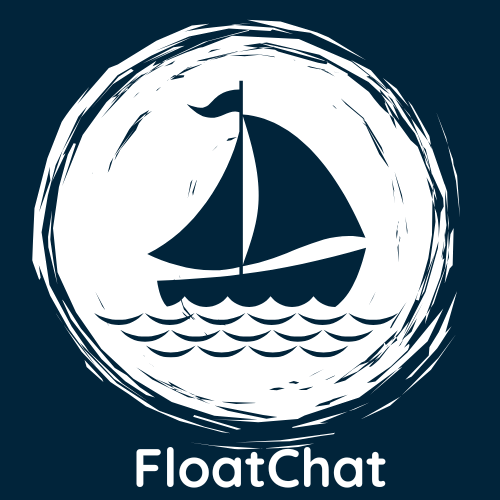
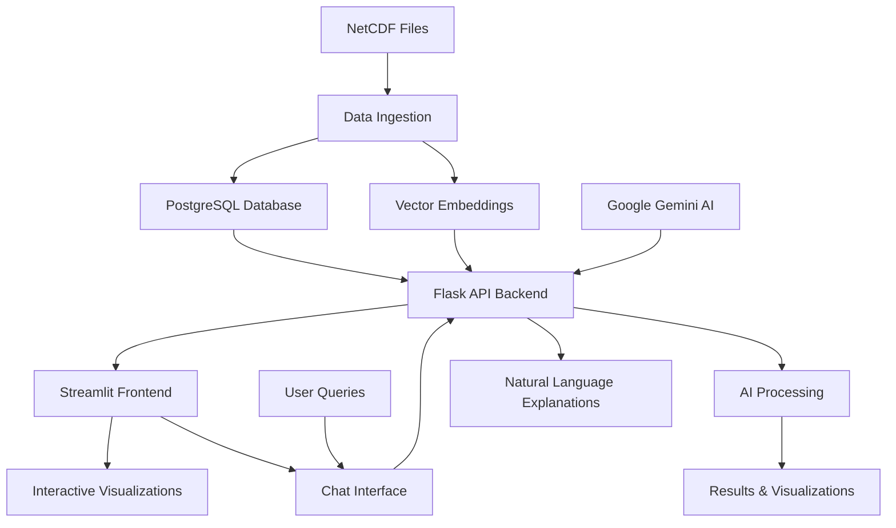
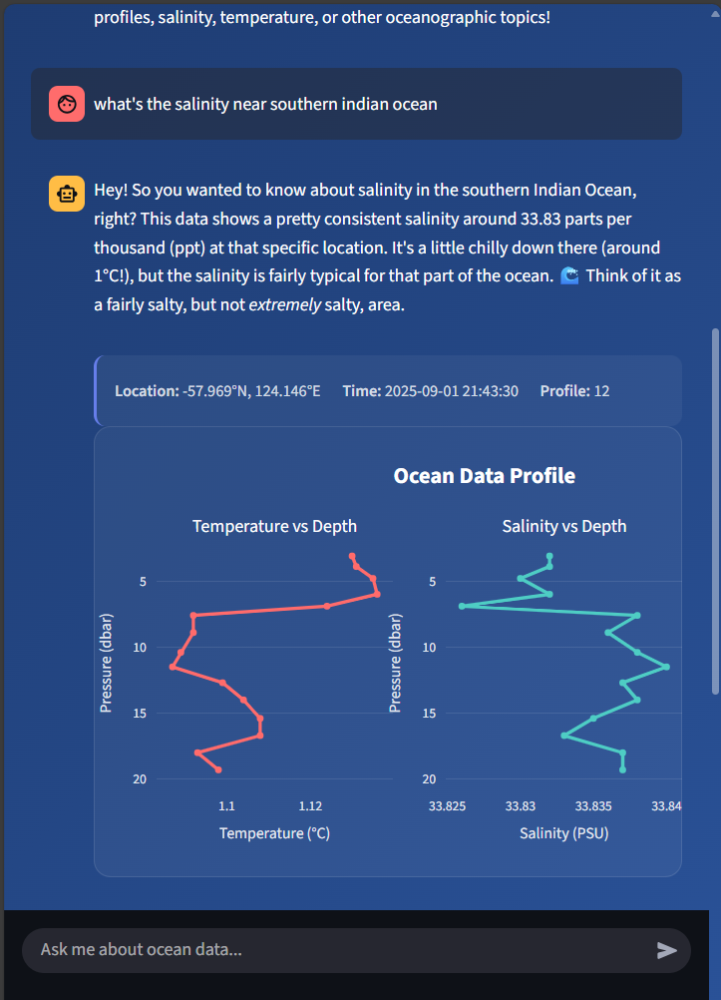
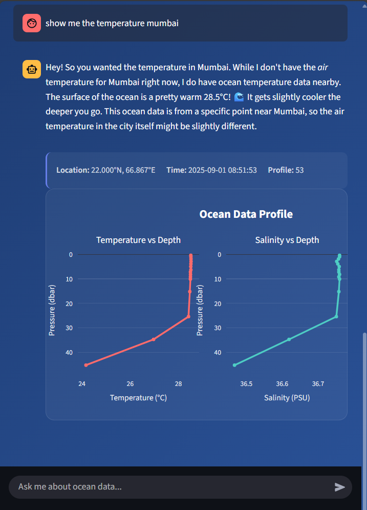

# 🌊 Neer Vaani - AI-Powered Ocean Data Explorer

<div align="center">



**Where Data Meets the Deep — Intelligent Ocean Data Analysis Made Simple**

[](https://python.org)
[](https://streamlit.io)
[](https://flask.palletsprojects.com)
[](LICENSE)

</div>

---

## What is Neer Vaani?

Neer Vaani is an innovative **AI-powered conversational interface** that transforms complex ARGO oceanographic data into intuitive, natural language queries. Built with modern technologies, it allows researchers, oceanographers, and data enthusiasts to explore ocean data through simple conversations, interactive visualizations, and intelligent insights.

*(Neer Vaani literally means “the voice of water” — a system that lets the ocean speak through data.)*

### Key Highlights

* **AI-Powered Search**: Uses sentence transformers and semantic embeddings for intelligent data discovery
* **Geospatial Intelligence**: Automatic geocoding and location-aware filtering
* **Interactive Visualizations**: Beautiful depth-time plots, maps, and real-time analytics
* **Natural Language Interface**: Ask questions in plain English about ocean data
* **Real-time Processing**: Fast query response with intelligent caching and hybrid scoring
* **Modern UI**: Beautiful Streamlit interface with ocean-themed design

---

## Architecture Overview



---

## Tech Stack

### Backend & API

* **Flask** - Lightweight web framework for API development
* **PostgreSQL** - Relational database for structured oceanographic data
* **Sentence Transformers** - AI embeddings using `all-MiniLM-L6-v2` model
* **Google Gemini AI** - Natural language processing for query explanations
* **psycopg2-binary** - PostgreSQL adapter for database operations

### Frontend & Visualization

* **Streamlit** - Interactive web application framework with custom CSS
* **Plotly** - Advanced 2D/3D data visualizations with interactive features
* **Pandas** - Data manipulation and analysis for real-time processing
* **Geopy** - Geocoding and location services for place name resolution

### Data Processing & ML

* **xarray** - Multi-dimensional NetCDF file processing
* **NumPy** - Numerical computing for vector operations
* **Pandas** - Data analysis and time series processing
* **SQLAlchemy** - Database ORM for advanced query operations

---

## 📁 Project Structure

```
neer-vaani/
├── 📁 api/                     # Flask backend service
│   ├── app.py                  # Main Flask application
│   ├── main.py                 # API entry point with CORS
│   ├── query.py                # Advanced query processing with Gemini AI
│   ├── fallback_query.py       # Fallback query handling
│   └── requirements.txt        # Backend dependencies
|
├── 📁 frontend/                # Streamlit user interface
│   ├── chatbot_ui.py           # Main chat interface with visualizations
│   ├── front.py                # Multi-page application with navigation
│   ├── map_page.py             # Geospatial visualizations and maps
│   ├── timedepthplot.py        # Depth-time analysis and heatmaps
│   ├── dummy.py                # Demo data utilities
│   ├── FloatChat.png           # Application logo (can be renamed)
│   ├── layered-waves-haikei.svg # Background graphics
│   └── requirements.txt        # Frontend dependencies
|
├── 📁 ingestion/               # Data processing pipeline
│   ├── main.py                 # NetCDF → PostgreSQL + Vector embeddings
│   ├── requirements.txt        # Ingestion dependencies
│   └── tempCodeRunnerFile.py   # Development utilities
|
├── 📁 data/                    # Raw NetCDF oceanographic files
│   └── 20250901_prof.nc        # Sample ARGO float data
|
├── 📁 infra/                   # Infrastructure and setup scripts
├── dummy.db                    # SQLite demo database
├── requirements.txt            # Global project dependencies
└── README.md                   # This documentation
```

---

## Quick Start Guide

### Prerequisites

* **Python 3.8+**
* **PostgreSQL 13+** (or SQLite for demo)
* **Git**

### 1) Clone the Repository

```bash
git clone https://github.com/SyedOwais312/floatchat.git
cd neer-vaani
```

*(Optional: rename the repository to `neer-vaani` on GitHub for consistency.)*

---

## Key Features

### Natural Language Interface

Ask questions in plain English about ocean data:

* *"Show salinity profiles near the equator"*
* *"Find temperature data near Mumbai"*
* *"Compare ocean data at lat=-43.037, long=130"*
* *"What's the salinity trend in the Pacific Ocean?"*

### AI-Powered Search

* **Semantic Search**: Find relevant data using meaning, not just keywords
* **Vector Embeddings**: 384-dimensional embeddings for precise matching
* **Hybrid Scoring**: Combines semantic similarity with geographic proximity
* **Natural Language Explanations**: AI-generated explanations using Google Gemini

### Advanced Visualizations

* **Interactive Maps**: Geospatial visualization of ARGO float trajectories
* **Depth-Time Heatmaps**: Visualize ocean parameters across time and depth
* **Profile Comparisons**: Side-by-side analysis of different ocean variables
* **Real-time Charts**: Dynamic Plotly visualizations with hover details

---

## Example Output

<div align="center">


*Neer Vaani answering oceanographic queries in natural language*


*Interactive depth-time visualization of ARGO float data*

</div>

---

## License

This project is licensed under the MIT License - see the LICENSE file for details.

---

<div align="center">

*Star ⭐ this repository if you find Neer Vaani helpful!*

</div>
