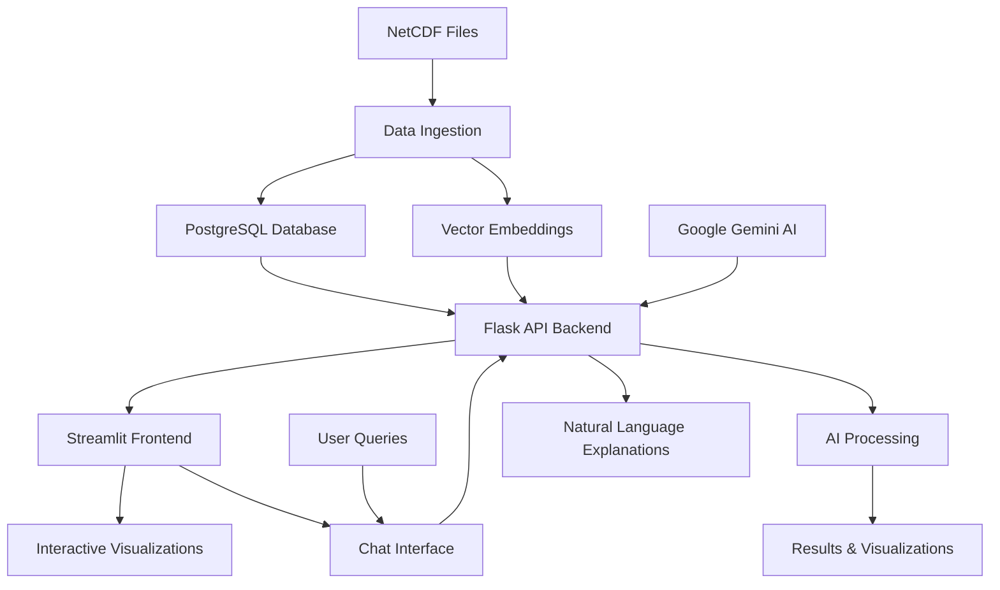

# 🌊 FloatChat - AI-Powered Ocean Data Explorer

<div align="center">


**Where Data Meets the Deep — Intelligent Ocean Data Analysis Made Simple**

[](https://python.org)
[](https://streamlit.io)
[](https://flask.palletsprojects.com)
[](LICENSE)


</div>

---

## What is FloatChat?

FloatChat is an innovative **AI-powered conversational interface** that transforms complex ARGO oceanographic data into intuitive, natural language queries. Built with modern technologies, it allows researchers, oceanographers, and data enthusiasts to explore ocean data through simple conversations, interactive visualizations, and intelligent insights.

### Key Highlights

- **AI-Powered Search**: Uses sentence transformers and semantic embeddings for intelligent data discovery
- **Geospatial Intelligence**: Automatic geocoding and location-aware filtering  
- **Interactive Visualizations**: Beautiful depth-time plots, maps, and real-time analytics
- **Natural Language Interface**: Ask questions in plain English about ocean data
- **Real-time Processing**: Fast query response with intelligent caching and hybrid scoring
- **Modern UI**: Beautiful Streamlit interface with ocean-themed design

---

##  Architecture Overview



---

## Tech Stack

### Backend & API
- **Flask** - Lightweight web framework for API development
- **PostgreSQL** - Relational database for structured oceanographic data
- **Sentence Transformers** - AI embeddings using `all-MiniLM-L6-v2` model
- **Google Gemini AI** - Natural language processing for query explanations
- **psycopg2-binary** - PostgreSQL adapter for database operations

### Frontend & Visualization
- **Streamlit** - Interactive web application framework with custom CSS
- **Plotly** - Advanced 2D/3D data visualizations with interactive features
- **Pandas** - Data manipulation and analysis for real-time processing
- **Geopy** - Geocoding and location services for place name resolution

### Data Processing & ML
- **xarray** - Multi-dimensional NetCDF file processing
- **NumPy** - Numerical computing for vector operations
- **Pandas** - Data analysis and time series processing
- **SQLAlchemy** - Database ORM for advanced query operations

---

## 📁 Project Structure

```
floatchat-clean/
├── 📁 api/                     # Flask backend service
│   ├── app.py                  # Main Flask application
│   ├── main.py                 # API entry point with CORS
│   ├── query.py                # Advanced query processing with Gemini AI
│   ├── fallback_query.py       # Fallback query handling
│   └── requirements.txt        # Backend dependencies
|
├── 📁 frontend/                # Streamlit user interface
│   ├── chatbot_ui.py           # Main chat interface with visualizations
│   ├── front.py                # Multi-page application with navigation
│   ├── map_page.py             # Geospatial visualizations and maps
│   ├── timedepthplot.py        # Depth-time analysis and heatmaps
│   ├── dummy.py                # Demo data utilities
│   ├── FloatChat.png           # Application logo
│   ├── layered-waves-haikei.svg # Background graphics
│   └── requirements.txt        # Frontend dependencies
|
├── 📁 ingestion/               # Data processing pipeline
│   ├── main.py                 # NetCDF → PostgreSQL + Vector embeddings
│   ├── requirements.txt        # Ingestion dependencies
│   └── tempCodeRunnerFile.py   # Development utilities
|
├── 📁 data/                    # Raw NetCDF oceanographic files
│   └── 20250901_prof.nc        # Sample ARGO float data
|
├── 📁 infra/                   # Infrastructure and setup scripts
├── dummy.db                    # SQLite demo database
├── requirements.txt            # Global project dependencies
└── README.md                   # This documentation
```

---

##  Quick Start Guide

### Prerequisites

- **Python 3.8+**
- **PostgreSQL 13+** (or SQLite for demo)
- **Git**

### 1️) Clone the Repository

```bash
git clone https://github.com/SyedOwais312/floatchat.git
cd floatchat-clean
```

### 2️)Install Dependencies

#### Option A: Install Everything (Recommended)
```bash
# Install all dependencies at once
pip install -r requirements.txt
```

#### Option B: Install Individual Components
```bash
# API only
pip install -r api/requirements.txt

# Frontend only  
pip install -r frontend/requirements.txt

# Ingestion only
pip install -r ingestion/requirements.txt
```

### 3) Database Setup

#### PostgreSQL Setup (Production)
```bash
# Create database and user
sudo -u postgres psql
CREATE DATABASE floatchatai;
CREATE USER floatchat_user WITH PASSWORD 'your_secure_password';
GRANT ALL PRIVILEGES ON DATABASE floatchatai TO floatchat_user;
\q
```

#### SQLite Setup (Demo - No Setup Required)
The project includes a `dummy.db` SQLite database for immediate testing.

### 4️) Environment Configuration

Create a `.env` file in the root directory:

```bash
# API Configuration
GOOGLE_API_KEY=your_google_gemini_api_key
QUERY_API=http://127.0.0.1:5000/query(for local)

# Database Configuration (if using PostgreSQL)
DB_HOST=localhost
DB_NAME=floatchatai
DB_USER=floatchat_user
DB_PASSWORD=your_secure_password
```

### 5️) Start the Application

#### Start Backend API
```bash
cd api
python main.py
# API will be available at http://localhost:5000
```

#### Start Frontend Application
```bash
cd frontend
streamlit run front.py
# Frontend will be available at http://localhost:8501
```

#### Data Ingestion (Optional)
```bash
cd ingestion
python main.py
# This processes NetCDF files and populates the database
```

### 6️) Access the Application

- **Frontend**: http://localhost:8501 - Interactive ocean data explorer
- **API**: http://localhost:5000 - REST API endpoints
- **Map Visualization**: Navigate to Map page in the frontend
- **Time-Depth Analysis**: Navigate to Depth-Time Plots page

---

## Key Features

### Natural Language Interface
Ask questions in plain English about ocean data:
- *"Show salinity profiles near the equator"*
- *"Find temperature data near Mumbai"*
- *"Compare ocean data at lat=-43.037, long=130"*
- *"What's the salinity trend in the Pacific Ocean?"*

### AI-Powered Search
- **Semantic Search**: Find relevant data using meaning, not just keywords
- **Vector Embeddings**: 384-dimensional embeddings for precise matching
- **Hybrid Scoring**: Combines semantic similarity with geographic proximity
- **Natural Language Explanations**: AI-generated explanations using Google Gemini

###  Advanced Visualizations
- **Interactive Maps**: Geospatial visualization of ARGO float trajectories
- **Depth-Time Heatmaps**: Visualize ocean parameters across time and depth
- **Profile Comparisons**: Side-by-side analysis of different ocean variables
- **Real-time Charts**: Dynamic Plotly visualizations with hover details

### Geospatial Intelligence
- **Automatic Geocoding**: Convert place names to coordinates
- **Location-Aware Filtering**: Filter data by geographic proximity
- **Distance Calculations**: Find nearest float data to any location
- **Coordinate Extraction**: Parse lat/long from natural language queries

---

## Usage Examples

### Natural Language Queries

```python
# Example queries you can ask:
"Show salinity profiles near the equator in March 2023"
"Compare temperature in Arabian Sea last 6 months"  
"Find temperature data at lat=-43.037, long=130"
"Show me ocean data near Mumbai"
"What's the salinity trend in the Pacific Ocean?"
```

### API Usage

```python
import requests
import json

# Query the API
response = requests.post(QUERY_API, 
                        json={"query": "Show salinity near the equator"})
data = response.json()

# Access results
for profile in data:
    print(f"Profile ID: {profile['profile_id']}")
    print(f"Location: {profile['lat']}, {profile['lon']}")
    print(f"Time: {profile['time']}")
    print(f"AI Explanation: {profile['query_explain']}")
    
    # Access depth-level data
    for level in profile['depth_levels']:
        print(f"  Pressure: {level['pres']} dbar, "
              f"Temperature: {level['temp']}°C, "
              f"Salinity: {level['salinity']} PSU")
```

### Frontend Navigation

The Streamlit frontend provides multiple pages:
- **Home**: Welcome page with feature overview
- **FloatChat**: AI-powered chat interface
- **🗺Map**: Interactive geospatial visualizations
- **Profile Comparison**: Side-by-side data analysis
- **Depth-Time Plots**: Time series and heatmap analysis

---

## ⚙️ Configuration

### Database Configuration

Update database credentials in the respective files:

```python
# api/main.py, ingestion/main.py
DB_CONFIG = {
    "host": "localhost",
    "database": "floatchatai",
    "user": "your_username", 
    "password": "your_password"
}
```

### API Configuration

```python
# api/query.py
TOP_K = 1                    # Number of top results to return
RADIUS_METERS = 50_000       # Search radius in meters
MODEL_NAME = 'all-MiniLM-L6-v2'  # Sentence transformer model
```

### Frontend Configuration

```python
# frontend/chatbot_ui.py
API_BASE_URL = "http://127.0.0.1:5000"(for local) # Backend API URL
TIMEOUT_SECONDS = 30                     # Request timeout
```

---

## Data Format

### Input Data
- **NetCDF Files**: ARGO float data in standard NetCDF format
- **Variables**: Temperature (TEMP), Salinity (PSAL), Pressure (PRES)
- **Metadata**: Latitude, Longitude, Time (JULD), Platform Number

### API Response Format

```json
{
  "profile_id": 123,
  "lat": -43.037,
  "lon": 130.0,
  "time": "2023-03-15 12:00:00",
  "depth_levels": [
    {"pres": 5.0, "temp": 18.5, "salinity": 35.2},
    {"pres": 10.0, "temp": 18.3, "salinity": 35.1}
  ],
  "query_explain": "Based on your query about salinity near the equator, I found oceanographic data from the Indian Ocean. The surface temperature is around 26.3°C, but it gets cooler as you go deeper..."
}
```

---

## Testing

### Run Demo Mode
The application includes a demo mode that works without a database:

1. Start the frontend: `streamlit run frontend/front.py`
2. Ask any ocean-related question (if you dont specify the data and time it will take the current date and time)
3. The system will provide demo data with realistic ocean profiles

### Test API Endpoints
```bash
# Health check
curl http://localhost:5000/

# Query test
curl -X POST http://localhost:5000/query \
  -H "Content-Type: application/json" \
  -d '{"query": "Show salinity near the equator"}'
```

---


### Code Style
- Follow PEP 8 guidelines
- Use meaningful variable names
- Add docstrings to functions
- Include type hints where possible

---
ollaboration Features** - Share and annotate findings

---

## 🙏 Acknowledgments

- **ARGO Program** - For providing the oceanographic data
- **Streamlit** - For the amazing web framework
- **Flask** - For the lightweight API framework
- **PostgreSQL** - For the robust database system
- **Sentence Transformers** - For the semantic search capabilities
- **Google Gemini** - For natural language processing
- **Hugging Face** - For the pre-trained models
- **Plotly** - For the interactive visualizations
- **Geopy** - For geocoding services

---

## Support

- **Issues**: [GitHub Issues](https://github.com/SyedOwais312/floatchat/issues)
- **Discussions**: [GitHub Discussions](https://github.com/SyedOwais312/floatchat/discussions)
- **Email**: Contact the maintainer for direct support

---

## License

This project is licensed under the MIT License - see the [LICENSE](https://github.com/Syedowais312/floatchat/blob/main/LICENSE) file for details.

---

<div align="center">

*Star ⭐ this repository if you find it helpful!*

</div>

## Example Output

Here’s what FloatChat looks like in action:

<div align="center">

  
*FloatChat answering oceanographic queries in natural language*

  
*Interactive depth-time visualization of ARGO float data*

</div>
